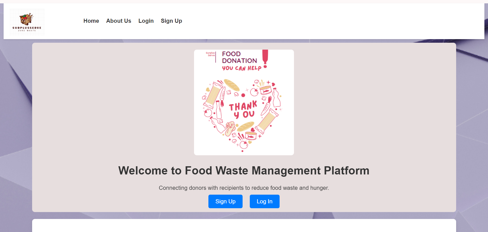
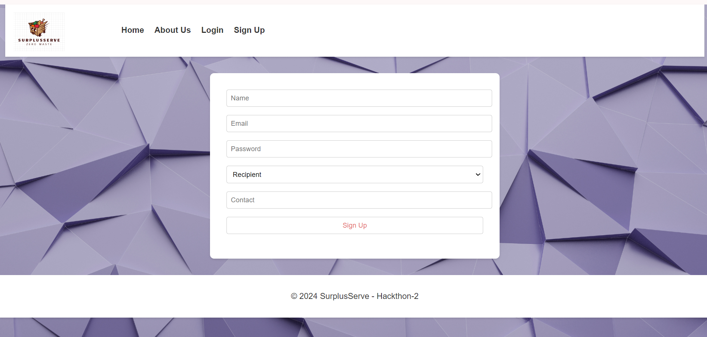

# 🍽️ Food Waste Management Platform

Welcome to the Food Waste Management Platform! Our mission is to connect food donors with recipient to reduce food waste and hunger. 🌍✨

## 🚀 Features

- 🥗 **For Donors**: Easily donate surplus food and help those in need.
- 🍽️ **For Recipients**: Find nearby food donations and contact donors directly.
- 🔔 **Real-time Notifications**: Receive instant notifications for new food donations.

## 🛠️ Tech Stack

- **Frontend**: React, Material-UI, TailwindCSS
- **Backend**: Node.js, Express, MongoDB
- **Authentication**: JWT

## 📸 Screenshots

## Presentation : https://drive.google.com/file/d/1kudwZTSz6_k_BDKlxsl5X3i9nLzMBII_/view

## Demo : https://drive.google.com/file/d/1ElggOP6iRO7yhxtY5zEThml27EJcAYgo/view

### Prerequisites

- Node.js
- MongoDB

📚 Usage

	1.	Sign Up: Create an account as either a donor or recipient.
	2.	Log In: Access your dashboard.
	3.	Donate Food: If you are a donor, add food items you wish to donate.
	4.	Find Food: If you are a recipient, browse available food donations and contact donors.

📧 Contact

If you have any questions or support, please email us at shashidharyadvr@gmail.com.

	###“Together, we can make a difference in reducing food waste and feeding those in need.”
